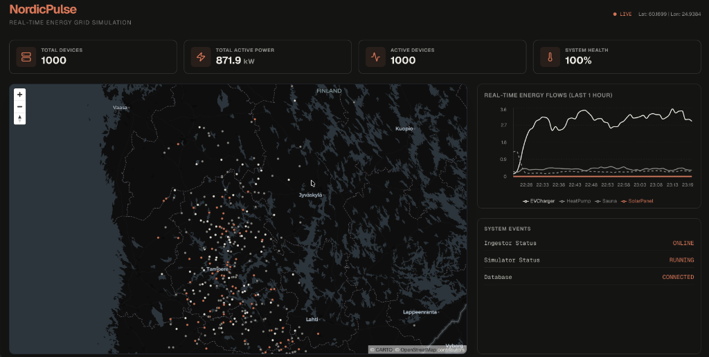
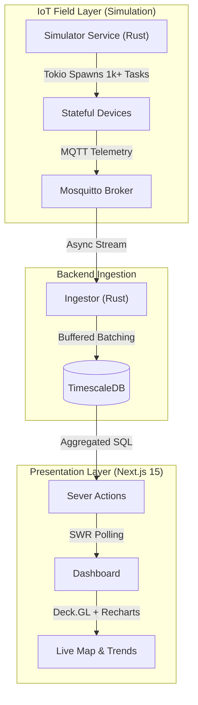

# NordicPulse 🌲
**Advanced Distributed Energy Resource (DER) Management & Real-time Visualization**



## About
NordicPulse is a high-performance, **Senior-level** demonstration of a localized energy monitoring platform. It manages **1,000+ concurrent IoT devices** (Solar Panels, EV Chargers, Heat Pumps) across Finland using a highly concurrent Rust backend and a modern, minimalist Next.js frontend.

## 🚀 Advanced Engineering Features

### 1. Organic Data Simulation (Stateful Physics)
Unlike simple random simulators, NordicPulse implements a stateful physics engine:
*   **Solar Panels:** Accurate day/night cycles using Sine waves adjusted by cloud noise and seasonal efficiency.
*   **EV Chargers:** Session-based state machine simulating real charging behaviors and idle states.
*   **Heat Pumps & Saunas:** Thermal inertia logic with smoothing (Lerp) and Brownian motion for realistic temperature drifts.

### 2. Clustered Geospatial Logic
Devices are distributed using **Population-weighted Gaussian Clusters** rather than uniform random boxes:
*   Concentrated hubs in **Helsinki**, **Tampere/Turku**, and **Oulu**.
*   Realistic "Rural North" spread for heating devices.
*   Geofencing to prevent "Ocean spillover" in coordinates.

### 3. Operational Excellence (Senior Polish)
*   **Database Hardening:** Optimized TimescaleDB schema with B-tree indexes on `device_id` for O(1) KPI retrieval.
*   **Retention Policies:** Native TimescaleDB background jobs to prune data older than 7 days, ensuring cost-efficiency and performance.
*   **Rust Unit Testing:** Physics logic and state transitions verified with `cargo test`.
*   **Modern Aesthetics:** Bespoke **Nordic Minimalist** theme (#f0eee6, #d97757, #141413) for a premium, specialized UI.

## System Architecture


## Getting Started

### Prerequisites
*   Rust (1.80+ / Edition 2024 ready)
*   Docker & Docker Compose
*   Node.js (LTS)

### Installation
1.  **Infrastructure:**
    ```bash
    docker-compose up -d
    ```
2.  **Rust Backend:**
    ```bash
    cargo run --bin simulator
    cargo run --bin ingestor
    ```
3.  **Frontend:**
    ```bash
    cd web && npm run dev
    ```
